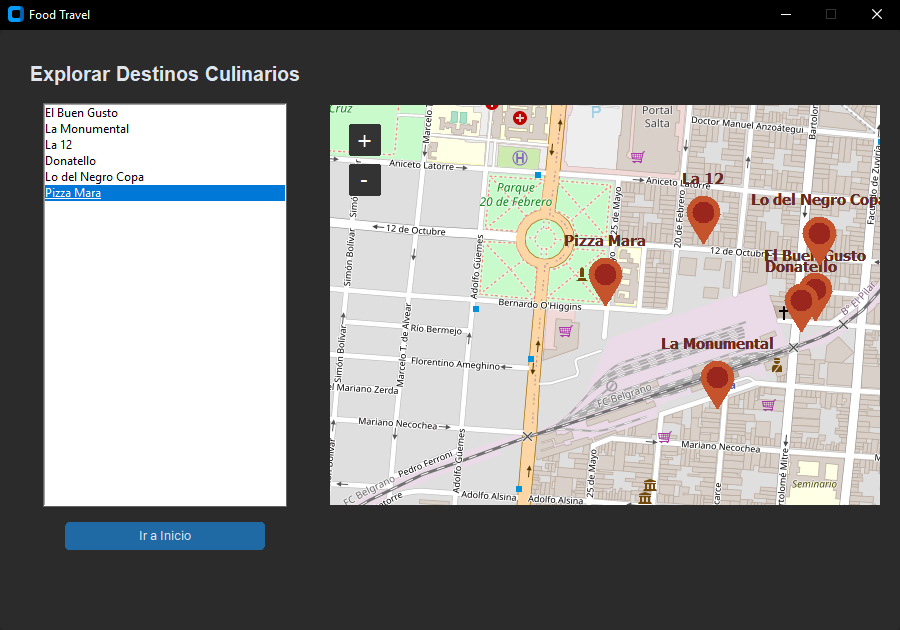
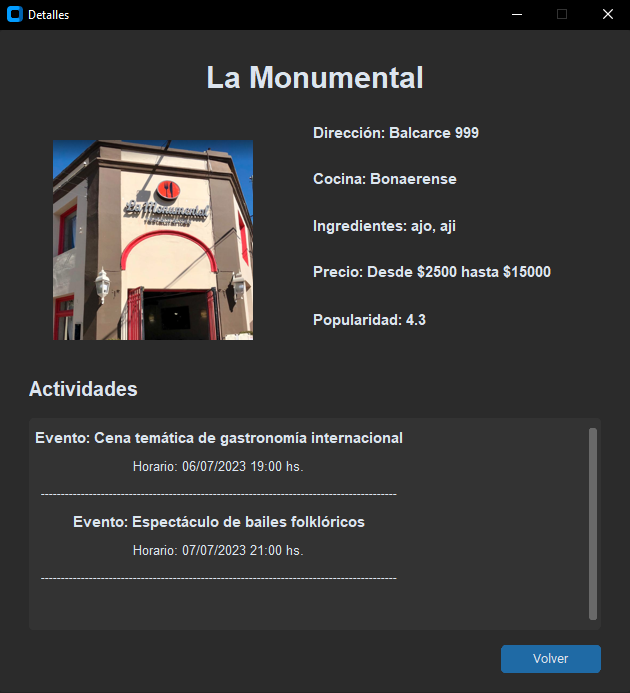
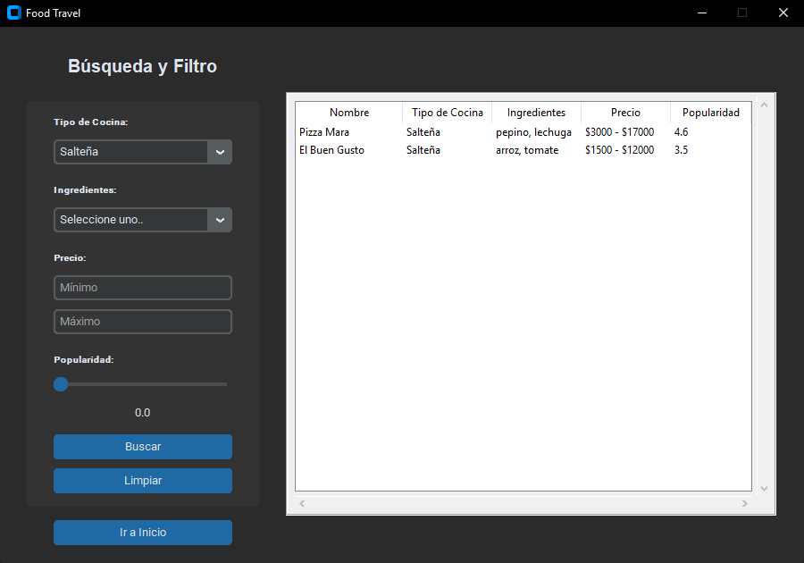
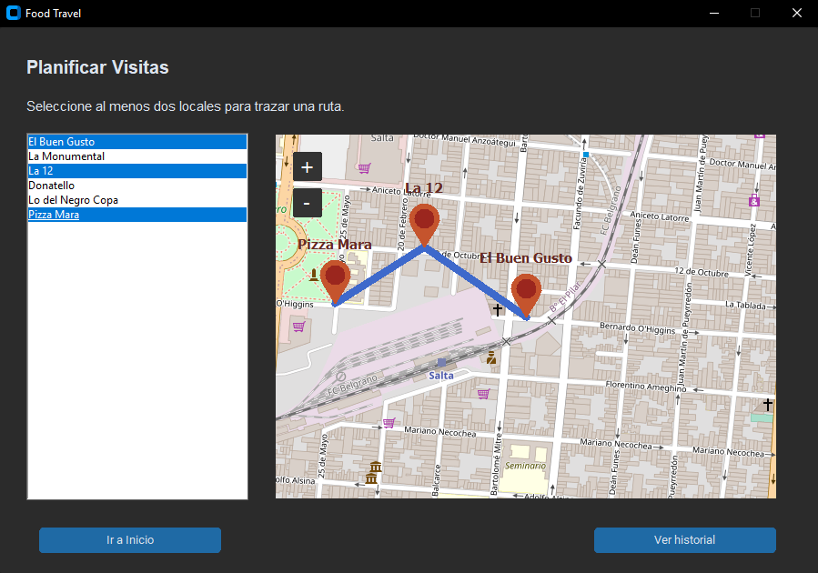
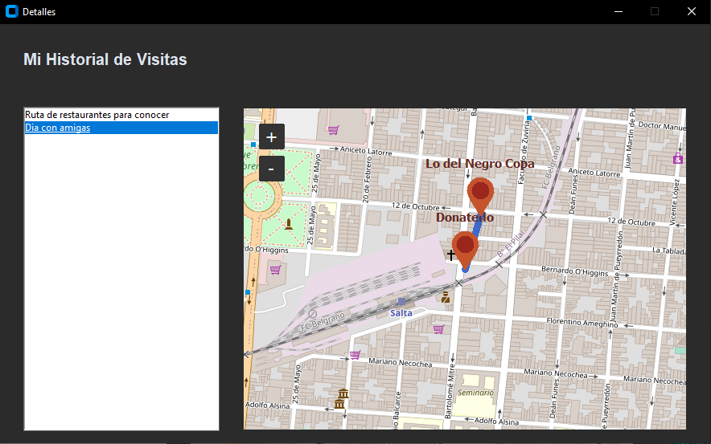
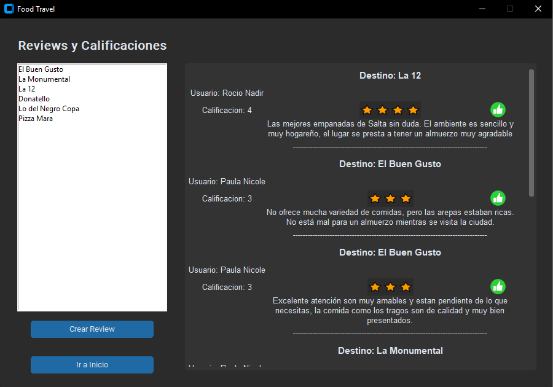
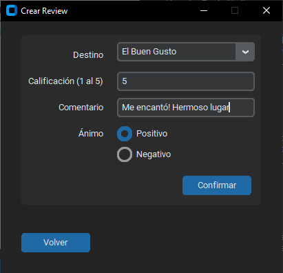

# Food Travel

Food Travel es una aplicación desarrollada en Python con CustomTkinter, que ayuda a los entusiastas culinarios a descubrir y planificar visitas a destinos culinarios de manera eficiente y organizada. La aplicación brinda información detallada sobre los lugares, eventos y actividades en diferentes destinos culinarios, y permite a los usuarios buscar, filtrar y planificar sus visitas de acuerdo a sus preferencias gastronómicas.

## ⚙️ Instalación <a name = "installation"></a>

1. Clonar el repositorio

```bash
https://github.com/paunicole/mil-programadores-tkinter-food-travel.git
```

2. Instala las dependencias del proyecto utilizando el archivo `requirements.txt`. Si aún no lo has hecho, puedes hacerlo ejecutando el siguiente comando:

```bash
pip install -r requirements.txt
```

3. Ejecutar la aplicación:

```bash
python main.py
```

## 🏛️ Estructura del proyecto <a name = "project_structure"></a>

El proyecto cuenta con una aplicación llamada foodie_tour que cuenta con los modelos Destino Culinario, Actividad, Ruta Visita, Ubicación, Usuario y Review. La estructura del proyecto es la siguiente:

```bash
raíz del proyecto
├───app/
│   ├───serializers/
│   ├───assets/
│   ├───controllers/
│   ├───data/
│   ├───models/
│   ├───views/
├───main.py
├───.gitignore
└───requirements.txt
```

## ⚡ Funcionalidades

> ### Destinos Culinarios en el Mapa

Los usuarios podrán explorar de manera interactiva diversos destinos culinarios en un mapa detallado. Cada destino estará representado con su índice de popularidad y disponibilidad actual, permitiendo a los usuarios descubrir tanto lugares icónicos como gemas ocultas de la gastronomía local.



> ### Información de Espectáculos y Actividades

La aplicación proporcionará minformación actualizada sobre los espectáculos y eventos que se celebran en cada destino culinario. Los usuarios podrán conocer los festivales de comida, conciertos en vivo, clases de cocina y otras actividades relacionadas que se llevarán a cabo en cada lugar.




> ### Búsqueda y Filtrado Avanzado

Los usuarios podrán realizar búsquedas y aplicar filtros para encontrar destinos culinarios acordes a sus preferencias. Podrán buscar según el tipo de cocina (oriental, regional, hindú, etc.), los ingredientes utilizados en la comida, el rango de precios (desde opciones económicas hasta experiencias gastronómicas exclusivas), y la popularidad de los platos. También se podrá buscar por eventos especiales, proporcionando información detallada sobre la hora, fecha y nombre del evento para que los usuarios no se pierdan ninguna experiencia culinaria
única.



> ### Planificación de Visitas

Los usuarios podrán planificar sus visitas creando rutas personalizadas que incluyan varios destinos gastronómicos. La aplicación les ofrecerá sugerencias inteligentes en función de sus preferencias culinarias y de las actividades programadas en cada lugar. Además, tendrán acceso a un historial de visitas realizado y podrán mantener
una lista de deseos basada en el tipo de cocina, lo que les permitirá destacar los lugares de su interés y organizar sus futuras visitas de manera más efectiva.





> ### Sistema de Reviews y Calificaciones

Después de visitar un lugar, los usuarios podrán dejar reviews y calificaciones para los locales gastronómicos. Estas reviews contribuirán al índice de popularidad del lugar, brindando a otros usuarios información valiosa y confiable para sus decisiones. Además, podrán explorar las reviews de otros entusiastas culinarios y descubrir los platos y experiencias más recomendados en cada
destino.





## ⛏️ Tecnologías utilizadas <a name = "technologies"></a>

- Python 3.11.4
- Pillow 9.4.0
- tkintermapview 1.29
- customtkinter 5.1.2
- osrm-py 0.5
- polyline 2.0.0
- folium 0.14.0
- CTkMessagebox 2.4

## ✒️ Autores <a name = "authors"></a>

| [<br><sub>Nicole Cardozo Gómez</sub>](https://github.com/paunicole) |  [<br><sub>Rocio Torres</sub>](https://github.com/trooh10) | [<br><sub>Adalberto Giménez</sub>](https://github.com/AdaGim) |
| :---: | :---: | :---: |